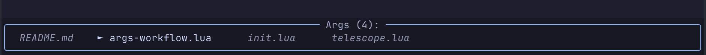

# nvim-args-workflow

> Enhanced Vim argument list workflow for Neovim with visual feedback and Telescope integration

A powerful Neovim plugin that supercharges Vim's argument list functionality with:
- **Visual feedback** with color-coded display
- **Telescope integration** for seamless file selection
- **Smart navigation** with enhanced commands
- **Auto-sync** - args list updates automatically
- **Error handling** - no more annoying Vim errors

## Features

### Visual Args Display


- Current file highlighted with `►` in **green**
- Other files in **muted gray**  
- File count in **blue title**

### Enhanced Navigation
- `[a` / `]a` - Navigate between args with visual feedback
- `[A` / `]A` - Jump to first/last arg with visual feedback

### Telescope Integration
- Select multiple files with `<Tab>` 
- Press `<C-a>` to convert selection to args list
- Works with any Telescope picker

### Smart Management
- `<leader>al` - Show args list
- `<leader>aa` - Add current file to args
- `<leader>ad` - Remove current file from args  
- `<leader>aD` - Clear all args

## Installation

### With [lazy.nvim](https://github.com/folke/lazy.nvim)
```lua
{
  'artero/nvim-args-workflow',
  dependencies = {
    'nvim-telescope/telescope.nvim', -- Optional but recommended
  },
  config = function()
    require('args-workflow').setup()
  end,
}
```

### With [packer.nvim](https://github.com/wbthomason/packer.nvim)
```lua
use {
  'artero/nvim-args-workflow',
  requires = { 'nvim-telescope/telescope.nvim' },
  config = function()
    require('args-workflow').setup()
  end
}
```

## Configuration

```lua
require('args-workflow').setup({
  -- Keymaps configuration
  keymaps = {
    list = '<leader>al',        -- Show args list
    add = '<leader>aa',         -- Add current file
    delete = '<leader>ad',      -- Remove current file  
    delete_all = '<leader>aD',  -- Clear all args
  },
  
  -- Visual configuration
  display = {
    current_indicator = '►',    -- Indicator for current file
    title_hl = 'Title',         -- Highlight group for title
    current_hl = 'String',      -- Highlight group for current file
    other_hl = 'Comment',       -- Highlight group for other files
  },
  
  -- Telescope integration
  telescope = {
    enable = true,              -- Enable telescope integration
    keymap = '<C-a>',           -- Key to convert selection to args
  },
  
  -- Auto-display configuration  
  auto_display = {
    enable = true,              -- Auto-display on args changes
    delay = 50,                 -- Delay in milliseconds
    timeout = 1000,             -- Timeout for auto-close
  },
})
```

## Usage

### Basic Workflow
1. **Build your args list:**
   - `<leader>sf` (Telescope find files) → `<Tab>` (select multiple) → `<C-a>`
   - Or manually: `<leader>aa` to add current file

2. **Navigate through files:**
   - `]a` - Next file with visual feedback
   - `[a` - Previous file with visual feedback  
   - `]A` - Jump to last file
   - `[A` - Jump to first file

3. **View your progress:**
   - `<leader>al` - See current args list
   - Args display updates automatically on changes

### Advanced Usage

#### Telescope Integration
- Works with **any** Telescope picker:
  - `<leader>sf` - Find files
  - `<leader>sg` - Live grep results  
  - `<leader>s.` - Recent files
  - `<leader>sc` - Git changed files

#### Args Management
- `:%argd` followed by `:argadd file1 file2 file3` 
- Visual feedback shows automatically
- No need to manually refresh

## Customization

### Custom Highlights
```lua
-- Define your own colors
vim.api.nvim_set_hl(0, 'ArgsWorkflowCurrent', { fg = '#00ff00', bold = true })
vim.api.nvim_set_hl(0, 'ArgsWorkflowOther', { fg = '#888888' })

require('args-workflow').setup({
  display = {
    current_hl = 'ArgsWorkflowCurrent',
    other_hl = 'ArgsWorkflowOther',
  },
})
```

### Custom Keymaps
```lua
require('args-workflow').setup({
  keymaps = {
    list = '<leader>va',      -- 'v' for view args
    add = '<leader>+',        -- '+' to add
    delete = '<leader>-',     -- '-' to remove
  },
})
```

## Requirements

- Neovim >= 0.8.0
- [nvim-telescope/telescope.nvim](https://github.com/nvim-telescope/telescope.nvim) (optional but recommended)

## Contributing

1. Fork the repository
2. Create your feature branch (`git checkout -b feat/amazing-feature`)
3. Commit your changes (`git commit -m 'Add amazing feature'`)
4. Push to the branch (`git push origin feat/amazing-feature`)
5. Open a Pull Request

## License

MIT License - see [LICENSE](LICENSE) file for details.

## Acknowledgments

- Inspired by
  - [Mastering Vim Quickly: From WTF to OMG in no time](https://www.amazon.com/Mastering-Vim-Quickly-WTF-time/dp/1983325740)
  - [Harpoon Plugin](https://github.com/ThePrimeagen/harpoon)
- Built for the modern Neovim ecosystem
- Telescope integration for seamless workflows

---

*Made with ❤️ for the Neovim community*
